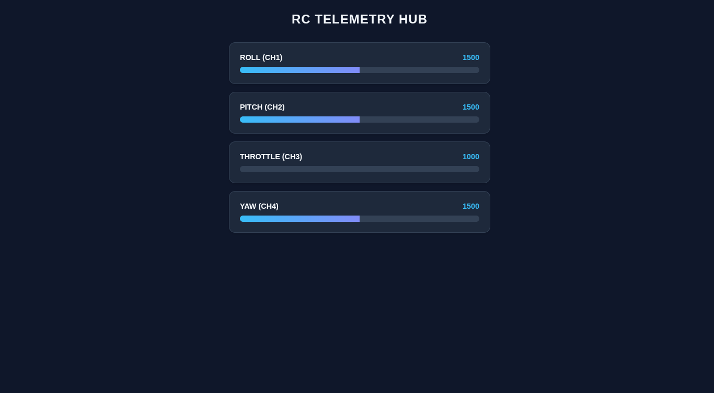

# ESP32 RC iBUS Live Monitor 🛰️


A real-time, low-latency web dashboard to monitor RC Receiver channels (iBUS protocol) using ESP32 WebSockets.

## ✨ Features
- **Zero-Lag Monitoring:** Uses WebSockets for real-time data streaming.
- **Wireless Access:** No USB needed, monitor directly on your mobile/PC browser.
- **Auto-Scale UI:** Responsive dashboard with dynamic progress bars.
- **Protocol:** High-speed iBUS (FlySky/Turnigy compatible).

## 🛠️ Hardware Requirements
* **Microcontroller:** ESP32 (32S, DevKit V1, or similar).
* **RC System:** FlySky/Turnigy Transmitter & iBUS compatible Receiver.
* **Power Source:** 5V via USB or External BEC.

## 🔌 Wiring Diagram

> **⚠️ IMPORTANT:** Always ensure a common ground (GND) between the ESP32 and the RC Receiver to prevent signal noise.

| Component Pin | ESP32 Pin | Description |
| :--- | :--- | :--- |
| **iBUS Signal** | **GPIO 16 (RX2)** | Serial Data Input |
| **VCC** | **VIN / 5V** | Power (Check your Receiver's voltage spec) |
| **GND** | **GND** | Common Ground |

## 📁 Project Structure
```text
.
├── assets/             # Dashboard screenshots and demo images
├── include/
│   └── index_html.h    # Frontend (HTML, CSS, JavaScript)
├── src/
│   └── main.cpp        # Backend logic (WiFi, WebSockets, iBUS)
├── platformio.ini      # Library dependencies and environment config
└── README.md

🚀 Installation & Setup

1. Prerequisites
Install PlatformIO IDE for VS Code.

2. Cloning the Project

git clone [https://github.com/ravi7564/IBUS_DATA_LOGGER.git](https://github.com/ravi7564/IBUS_DATA_LOGGER.git)
cd IBUS_DATA_LOGGER

3. Uploading to ESP32

Connect your ESP32 via USB.
Use the PlatformIO: Upload button ($\rightarrow$ icon).

Tip: If you see "Failed to connect", hold the BOOT button on the ESP32 while uploading.4. 

4. Usage:
Power on your RC Transmitter and Receiver.
Connect your device to the WiFi: ESP32-RC-Safe.
Open browser and navigate to: http://192.168.4.1
Move the transmitter sticks and watch the bars react in real-time!

📱 Dashboard Preview

🛡️ Safety & Disclaimer
Props Off: Always remove propellers from your drone or plane while testing on the bench.
Signal Interference: For best results, keep the ESP32 away from high-power RF sources while testing.
